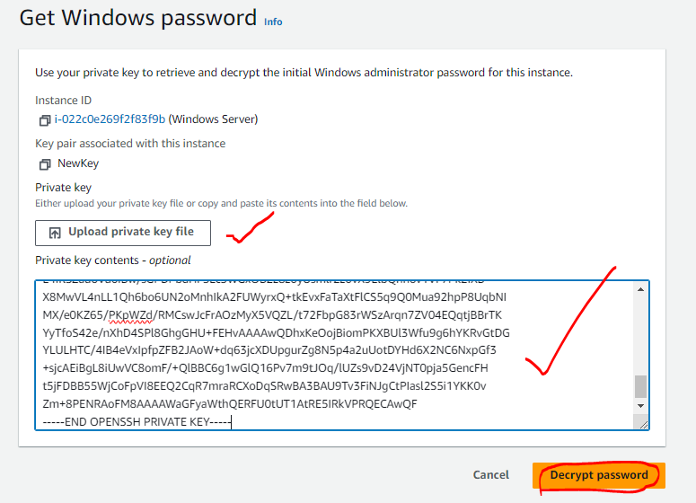
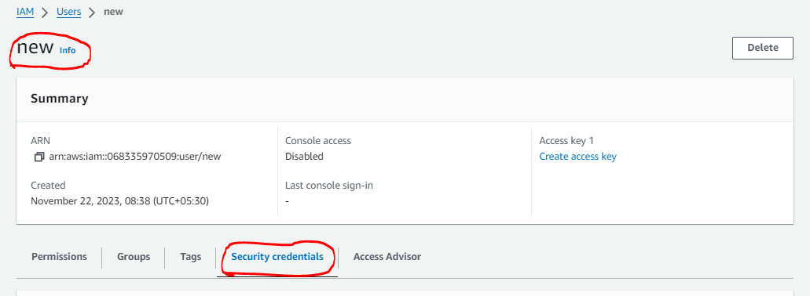
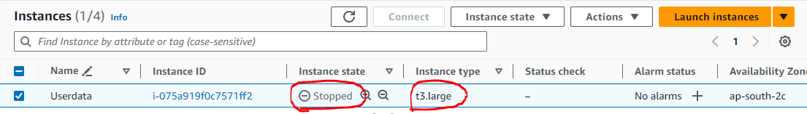
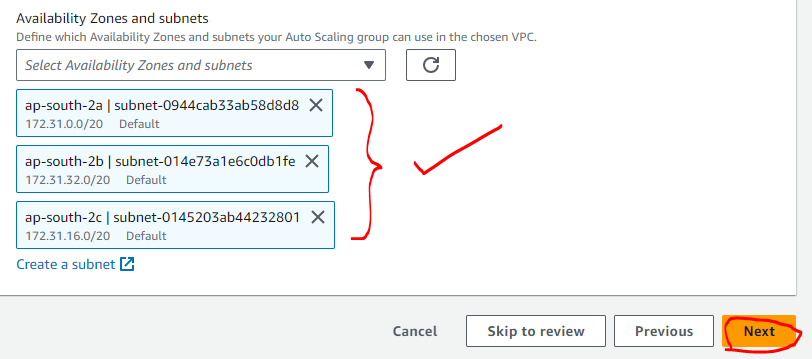
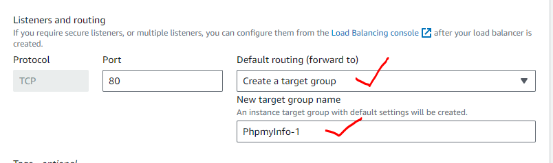
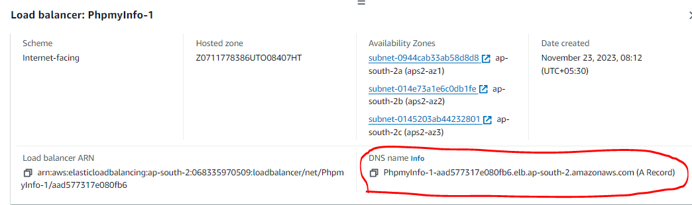
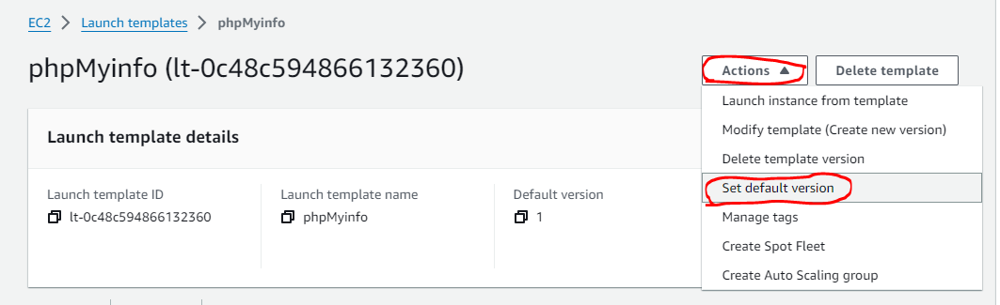
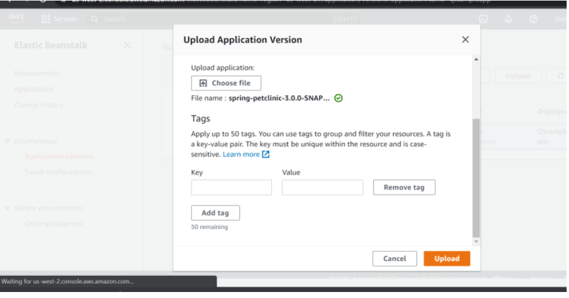
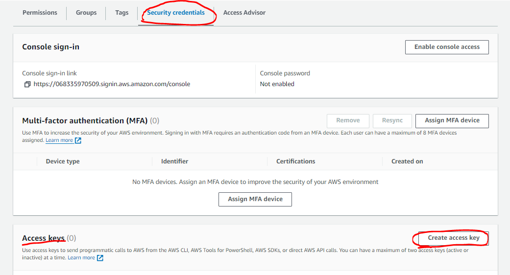

## COMPUTE

### Creating a key-pair

=> Key pairs => Create key pair => select Name, RSA, .pem => Create key pair


### Creating Windows 2019 server

=> Launch instance => Name : Windows Server => select Microsoft Windows Server 2019 Base => t3.large => select the created key pair => launch instance 


### Connecting to a remote machine

=> select the instance => select connect => RDP client => select connect using RDP client => Get password => Upload private key file => Decrypt password




=> On desktop Run => type : mstsc -v <public_ip> => OK


### Deploying application using userdata option ( PHP SERVER )

* Start an ec2 instance of ubuntu 22.04
* Add USERDATA in advanced setting details :
```
#!/bin/bash
apt update
apt install apache2 stress -y
apt install php libapache2-mod-php php-mysql -y
echo '<?php phpinfo(); ?>' > /var/www/html/info.php
systemctl restart apache2
```


* Access the application over the browser using public_ip and the php page 
```
http://<public _ip>
http://<public _ip>/info.php/
```


### Creating an AMI image for the present php page

=> Select the instance => Actions => Images and templates => Create image 


* Give image name and description ( snapshots are also created with the image creation )


### EC2 image creation using Packer

* To use packer, we need to have the following
   * Packer
   * aws cli
   * IAM user with programmatic access

* Installing Packer and unzip
```
sudo apt update
curl -fsSL https://apt.releases.hashicorp.com/gpg | sudo apt-key add -
sudo apt-add-repository "deb [arch=amd64] https://apt.releases.hashicorp.com $(lsb_release -cs) main"
sudo apt-get update && sudo apt-get install packer
packer --version
```


* Installing AWS CLI
```
curl "https://awscli.amazonaws.com/awscli-exe-linux-x86_64.zip" -o "awscliv2.zip"
unzip awscliv2.zip
sudo ./aws/install
aws --version
git --version
```


### Creating an IAM User

=> IAM => users => Create user 


=> username => next 


=> Attach policies directly => Administrative access 


=> next => Create user 


* Security Credentials for user

=> click on user => Security credentials 



=> Access keys => create access key 


=> Select Command Line Interface (CLI) => next 


=> add description tag => create access key


* Configuring user

=> on command line => aws configure => copy and paste Access Key and Security Access Key


* To check for working 
```
aws s3 ls
```


### Changing the Instance type after launching it

=> Stop the running instance 


=> Actions => Instance settings => Change instance type 


=> select the desired size => Apply




* Installing stress and monitoring the metrics
```
sudo apt install stress -y
stress
stress --cpu 10 --io 40 --vm-bytes 256M --timeout 10m -
```


### Launch Templates

=> Launch template => Give name and description => select template to use with ec2 auto scaling 


=> My AMIs => Owned by me => Create launch template 


=> Actions => Launch instance from template


### Auto Scaling Groups (ASGs)

=> Auto Scaling groups => Create auto scaling group => name, template name, version => Next


=> select network, subnets => Next 




=> Attach to a new load balancer => select network load balancer, select internet-facing => select target group (create new target group) => give health check in 300 seconds => Next





=> Max,min,desired capacities = 2:2:2 for fixed = 1:1:5 for selection 


=> select Target tracking scaling policy 


=> give name, metric type = Average CPU utilization => Target value = 60 => Instances need = 10 


=> Next => Next => Next => create auto scaling group


=> select the group created => select Instance management


=> select Load Balancer => select the created load balancer => copy the DNS name of the load balancer => expose application over browser with DNS name





* Increase the stress and see the scale out happen after login into the scaled machine
```
stress --cpu 16 --timeout 20 -v
```


* Now kill the stress process (Ctrl C) and wait for the machines to scale in

### Creating Auto Scaling Group without attaching any scaling policies

* Create a auto scaling group using previous image and launch template

=> Auto scaling groups => select name, launch template => Next


=> select the subnets available for the vpc => Next


=> select new load balancer => select network load balancer


=> Load balancer scheme : internet-facing => port : 80 => Default : protocol|TCP => Next


=> Capacities - 1:1:5 => No scaling policies => Next => Next => Next => Create auto scaling group


* Now creating a dynamic scaling policy


=> Policy type : Step Scaling => name : scaleout => create CloudWatch alarm => Select metric


=> Ec2 => Auto scaling groups => group-name : CPU utilization => Select metric


=> Edit the information => Threshold type : Static => Utilization : Greater/Equal (>=75%) => 75 => Next


=> Add notification to alarm => Next => name : scaleout => Next => Create alarm


=> Back to creating policy dynamically => select scaleout => capacity units : 1 => Create


=> Repeat the same creating policy for the scalein also


* Simple Scaling has an extra _**cooldown period**_ during which scaling will not happen

* Create an image (`PhpmyInfo1`) using the nginx server (adding as userdata) 


* Modifying the Launch Template and add the latest version as the default version




* Goto Auto scaling groups and do instance refresh


=> Start instance refresh => Update launch template => Start instance refresh


### Cloud Watch Scheduler

=> CloudWatch => Events => Rules 


=> Create rule => Rule Name => description => select schedule => select continue to create rule


=> select fine-grained schedule => write cron expression => next


=> Write the cron expression and select UTC for time zone


* PROBLEMS : 
   * Adding Targets requires you to give instance id’s. In AWS we have tags
   * API To start instance was not found
   * If we use Event Bridge we have access to all APIs but we need some role to do the job. We need to configure the role
* SOLUTION : 
   * Fetching instance ids
   * Configuring Role
   * CLI option:
      * Need to work with aws cli i.e. configure IAM user
      * need to understand json
      * Searching aws cli options
   * Lambda:
      * Knowing a programming language
      * Configure IAM Role

### Updating OS in EC2 instance

* I have an ec2 instance with ubuntu 20.04, in this i need to install an os update (Patching)
* Possible Solutions: Try to figure out

### Securing Access

* You are an aws administrator and your organization has two projects and keys are maintained at project
* You were asked to do some activity on linux machine (ec2 instance)
* How can you login without ssh key

### Lost PEM file

* Some of your team member has lost pem file and we need to recover the server


### AWS Elastic Beanstalk

* Creating sample Beanstalk application

=> search for Elastic Beanstalk => Create Application 


=> Type name


=> Platform : Java => branch : coretto 17 running on 64bit Amazon Linux2 => version : 3.4.4 (Recommended) => Application code : Sample application => Create application


=> Environments


=> Health check and Platform


=> open link created over the browser `http://<link>`


=> Application versions




=> Actions => Deploy


=> set Environment => Deploy


* Rolling back updates


* Creating a Lambda function

=> Lambda => Functions => Create function


### AWS CLI

* To authentiate AWS CLI we need to generate IAM user Credentials

=> IAM on console => select Users => Create user


=> Give a name => Next


=> Attach policies directly => select `AdmintratorAccess` policy => Next


=> Create user 


=> select Security credentials => Access keys => Create Access keys



=> select Command Line Interface(CLI) => check the option box => Next


=> Attach tags => Create access key => Down load the keys


=> Do `aws configure` on the commandline


* General commands with prefixes :
   * to view `describe*` `list*`
   * to create `create*` `run*`
   * to delete `delete*` `terminate*`
   * to modify `modify*` `update*`

* --region and --query are supported


### Exercise

* Try doing the same to install php info page with ubuntu 20 ami
* delete the ec2 instance
* The below script is to create an ec2 instance and also to terminate the instance after the use of this instance
```
#!/bin/bash

# get the ami id
ami_id=$(aws ec2 describe-images --filters "Name=name,Values=ubuntu/images/hvm-ssd/ubuntu-focal-20.04-amd64-*" --query "Images[0].ImageId" --output text)


# get default vpc id
vpc_id=$(aws ec2 describe-vpcs --filters "Name=is-default,Values=true" --query "Vpcs[0].VpcId" --output text)

# create security group with 22,80 ports opened
sg_id=$(aws ec2 create-security-group --group-name sshnhttpsg --description "open 22 and 80" --vpc-id $vpc_id --output text --query "GroupId")

# open 22,80 ports to all
aws ec2 authorize-security-group-ingress \
    --group-id $sg_id \
    --protocol tcp \
    --port 22 \
    --cidr '0.0.0.0/0'

aws ec2 authorize-security-group-ingress \
    --group-id $sg_id \
    --protocol tcp \
    --port 80 \
    --cidr '0.0.0.0/0'

# get the instance id
aws ec2 run-instances \
    --image-id $ami_id \
    --instance-type "t2.micro" \
    --key-name "my_id_rsa" \
    --security-group-ids $sg_id \
    --associate-public-ip-address

# using instance id fetch public ip
public_ip=$(aws ec2 describe-instances --filters "Name=instance-state-name,Values=running" --query "Reservations[0].Instances[0].PublicIpAddress" --output text) 
echo "http://${public_ip}"
```
* Login to the machine using the IP address generated from the  above script and expose the page over the browser `http://<public_ip>`

* Queries for :
   1. AMI id
   2. security group (22 & 80)
   3. key pair : my_id_rsa
   4. instance size : t2.micro

   * ami_filter_name name
   * ami_filetr_value ubuntu/images/hvm-ssd/ubuntu-jammy-22.04-amd64-server-20230208
   * aws_keypair_name
   * instance_type
   * security_group_id

## Compute - Workshop (18/Mar/2023)

* Areas of Focus
   * Automation
   * Administration

#### Activity-1 : Shutdown all instances which have tag `QA`

* Setup : Create 3 ec2 instances of `free tier` and provide `tags`
   * Machine 1 => QA => Env: QA
   * Machine 2 => Dev => Env: Dev
   * Machine 3 => UAT => Env: UAT


* To differ the instances using tags and output as text and to get more than one environment (refer from aws cli cheat sheet for options)
```
aws ec2 describe-instances --filter "Name=tag:Env,Values=QA/Dev/UAT" --query "Reservations[].Instances[].InstanceId"
```
```
aws ec2 describe-instances --filter "Name=tag:Env,Values=QA/Dev/UAT" --query "Reservations[].Instances[].InstanceId" --output text
```
```
aws ec2 describe-instances --filter "Name=tag:Env,Values=QA,Dev,UAT" --query "Reservations[].Instances[].InstanceId" --output text
```


_**NOTE : We need to apply it in a new repository created to work accordingly**_

* For the _**CLI**_ with script `activity .sh`

   [ Refer here : https://github.com/asquarezone/awsadministration/commit/50d0ac97a2a90e7958fad3ea05e93a95719e902d ]

* Improvement-1 : This script was failing if there are no instances having matching critiera, so we add a _**flag or condition**_ `activity1.sh`
   * For changes

   [ Refer here : https://github.com/asquarezone/awsadministration/commit/2ad90adae3da28e2e35942be55c79fc34c0f2788 ]

* Improvement-2 : Make this script work for tag `Env=Dev` 
   * For the imporvement where user can now call `activity2.sh` `<tag-name> <tag-value>`

   [ Refer here : https://github.com/asquarezone/awsadministration/commit/634b76edfa274b698cec6905f22c3d0a26adbf20 ]


#### Activity-2 : Resize the EC2 instance from `t2.micro` to `t2.nano` based on _**tags**_ `activity3.sh`


* For the changes

   [ Refer here : https://github.com/asquarezone/awsadministration/commit/d0f63d9ac4b8edd9259a5cb88ea0fcec562dc206 ]

#### Activity-3 : EC2 Systems Manager

* Systems Manager can be used to control `Linux or Windows` workload in
   * AWS
   * Other Cloud Providers
   * On-premises
   * IOT


* General Setup of Systems Manager 

   [ Refer here : https://docs.aws.amazon.com/systems-manager/latest/userguide/setting_up_prerequisites.html ] and 

   [ Refer here : https://docs.aws.amazon.com/systems-manager/latest/userguide/systems-manager-setting-up-ec2.html ] for setup on ec2 instances

### Setting up Systems Manager

* For pre-requisites

   [ Refer here : https://docs.aws.amazon.com/systems-manager/latest/userguide/systems-manager-setting-up.html ]

* Navigate to Systems Manager

* Create another user

=> Service => IAM => Users => give name, select the user access => want to create IAM user => custom password => Next


=> Attach policies directly => Administrator access => Next => Create user


* Login into the console using the created IAM user


* Now create an `Instance Profile`

   [ Refer here : https://docs.aws.amazon.com/systems-manager/latest/userguide/setup-instance-permissions.html ]

* To attach _**IAM**_ role to existing ec2 instance

   [ Refer here : https://docs.aws.amazon.com/systems-manager/latest/userguide/setup-instance-permissions.html#attach-instance-profile ]

* AWS Recommends using `Configure Default Host Management`

   * Navigate to systems Manager => Fleet Manager =>

* Now we can recover from key lost scenarios

   [Refer here : https://repost.aws/knowledge-center/user-data-replace-key-pair-ec2 ]
